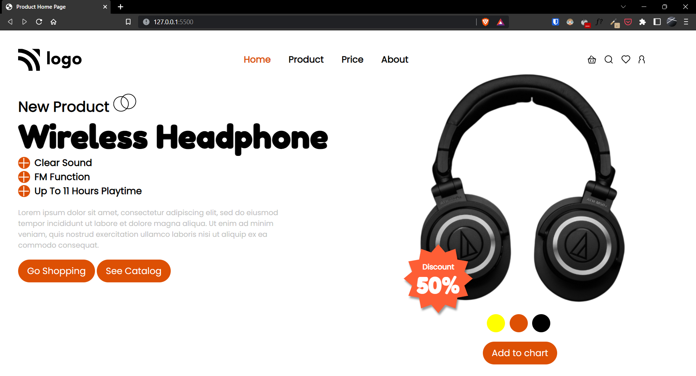

# Project-07 | Product HomePage

Hi there,
I'm Wasit Ali and this is my 6th project on HTML and CSS.

## 🖥 Preview

🚀 [Live Preview](https://flourishing-cupcake-cd4f3a.netlify.app/)

## 🛠️ What I have learned in this project?

- More about flex-box properties and how to handle them.
- Also learnt about buttons and adding cursers.
- Use of background image with smaller resolution.
- Responsivness.

## ⏲ Time to finish the project

- Around 10 hours
